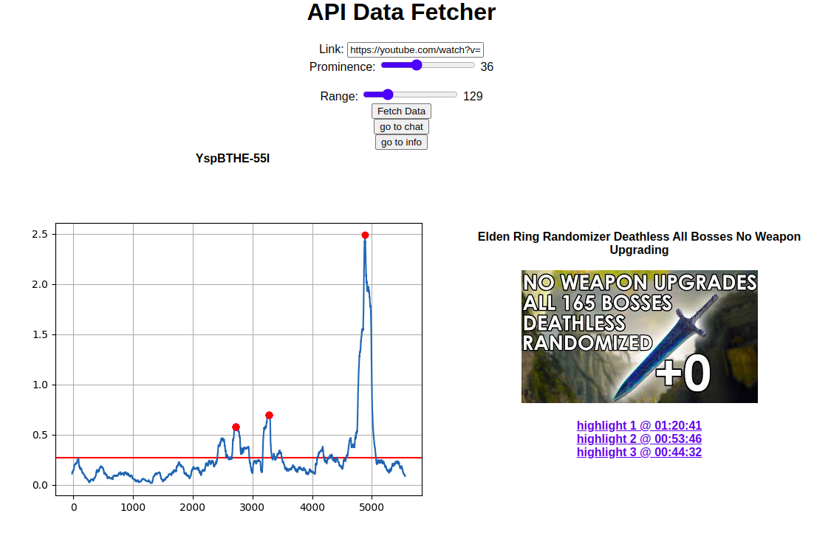

## Chat-utils

Barebone interface to automatically analyze youtube live chat and find highlights



# How it works
Fetches messages from live chat, runs a convolution on the messages frequency, finds highlights based on chat messages concentration

Parameters:

- `Link` url of youtube stream  
- `Prominence` parameter to identify peaks, lower values = more peaks found, higher values = only more prominent peaks found
- `Range` width of convolution window

# How to run
Bare metal
```
git clone https://github.com/Massiccio1/chat-utils.git
cd chat-utils
bash requirements.txt
python3 api.py
```
Docker essential
```
git clone https://github.com/Massiccio1/chat-utils.git
cd chat-utils
docker build -t chat-utils .
docker run -d -p 8060:8060 chat-utils
```
Docker compose with mounted folders form permanent data

```
git clone https://github.com/Massiccio1/chat-utils.git
cd chat-utils
docker build -t chat-utils .
docker compose up -d
```

and go to http://127.0.0.1:8060/index

There are 3 visual interfaces:

- `/index` - starting page to run the script
- `/chat` to view and filter already analyzed lives
- `/info` to display all the analyzed lives

And 1 useful API endpoint, also usable with scripts:
- `/parse` - POST with body
```
{
    "url": stream url,
    "prominence": prominence value (usual values 30-60)
    "range": width of the convolution window
}
```
- response:
```
{
    'success': bool,
    'message': str,
    'data': {
        'id': stream id,
        'peaks': array of highlight timestamps, ordered from most prominent
        'range': int,
        "title": stream title
    }
}
```